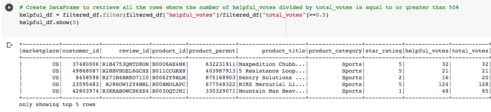
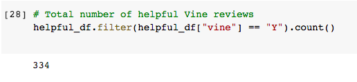
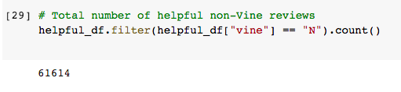
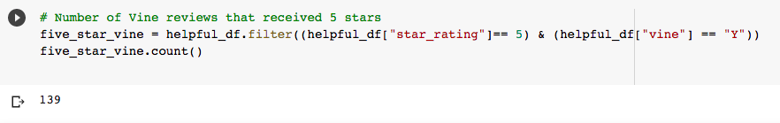
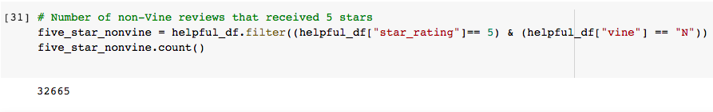
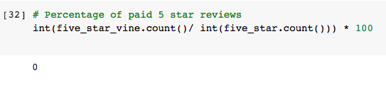
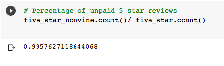

# Amazon_Vine_Analysis

## Overview
The purpose of the analysis is to determine if having a paid Vine review makes a difference in the percentage of 5 star review

## Results

### Number of Vine reviews and non-Vine reviews

Based on the DataFrame above, the total number of helpful Vine reviews out of total number of helpful reviews are only 334 which is less than 1%

Based on the DataFrame above, the total number of helpful non-Vine reviews out of total number of helpful reviews are 61614 which is more than 99%

### Number of 5 star Vine reviews and 5 star non-Vine reviews

Based on the DataFrame above, the number of Vine reviews with 5 stars was 139

Based on the DataFrame above, the number of non-Vine reviews with 5 stars was 32,665

### Percentage of 5 star Vine reviews and 5 star non-Vine reviews

Based on the DataFrame above, the percentage of Vine reviews with 5 stars out of the total number of 5 star reviews is less than 1%

Based on the DataFrame above, the percentage of non-Vine reviews with 5 stars out of the total number of 5 star reviews is more than 99%
